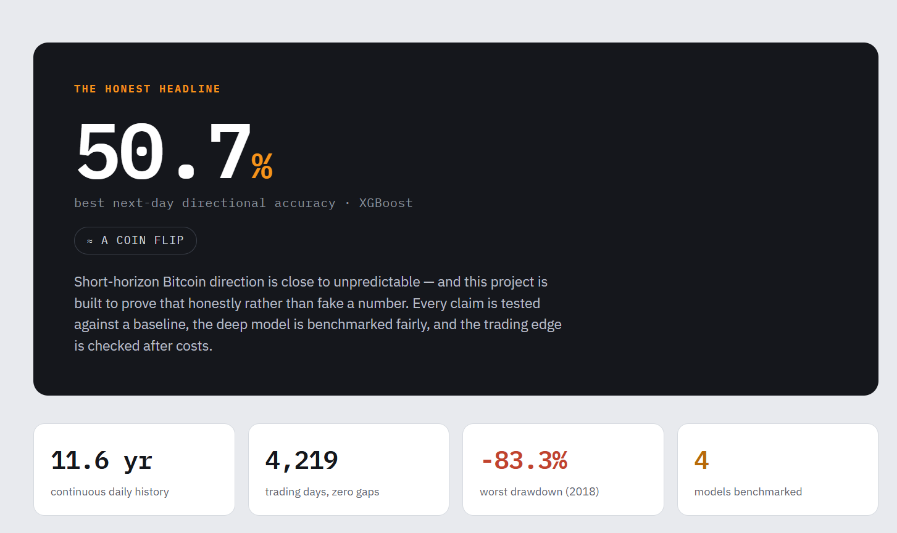
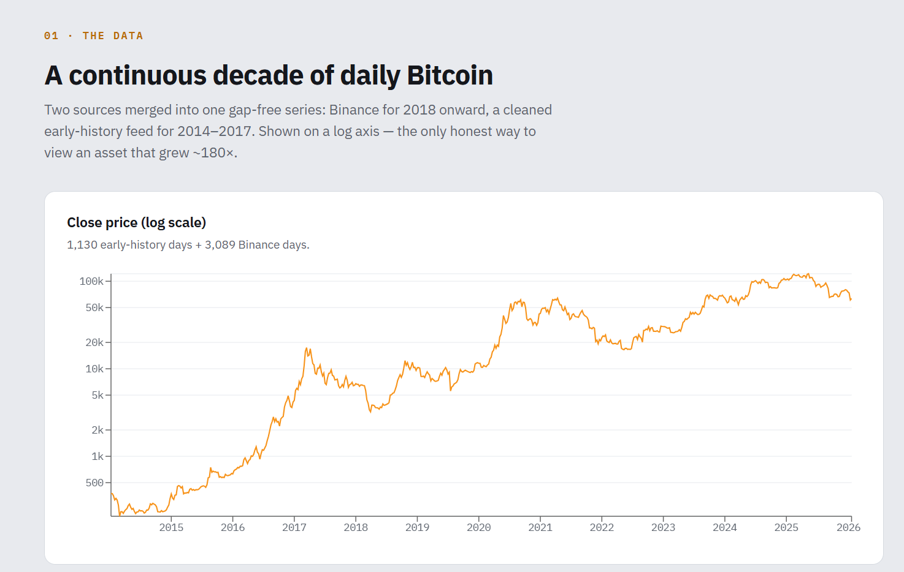
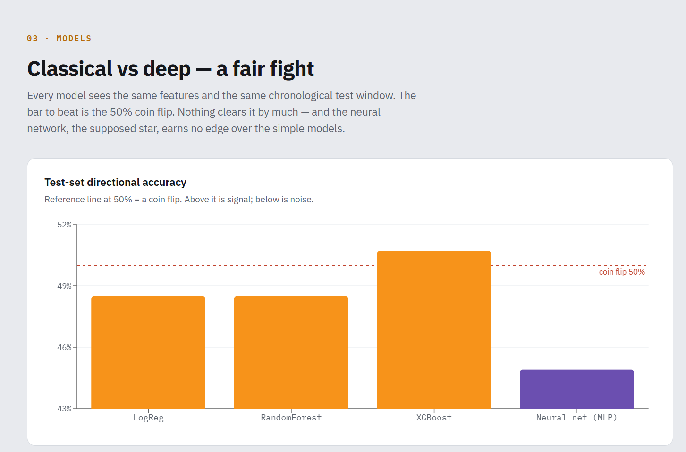
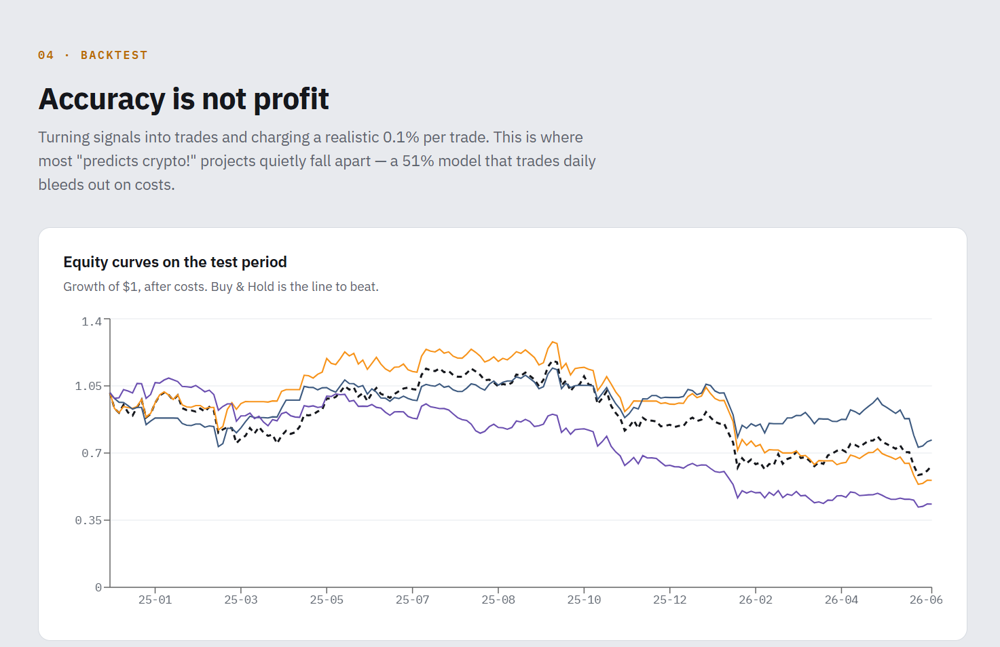

# Bitcoin Trend Prediction

An end-to-end, reproducible research pipeline for analysing and forecasting Bitcoin price behaviour — from an automated data layer, through full statistical analysis, classical machine learning, and a neural-network benchmark, ending in a cost-aware backtest and an interactive dashboard.

The guiding principle is **honesty over hype**. Short-horizon cryptocurrency direction is close to unpredictable, so this project is built to *measure that honestly* — with leakage-aware splits, baselines the models must beat, and a backtest that charges real trading costs — rather than to manufacture a misleading accuracy number.

> **Live dashboard:** https://bitcoin-trend-predictions.vercel.app/



## The honest headline

On out-of-sample data (2014–2026, 4,219 continuous daily rows), the best model reached **50.7% next-day directional accuracy (XGBoost)** — barely distinguishable from a 50% coin flip, with no model achieving an AUC meaningfully above 0.5. That is the *correct* result for an efficient market, and surfacing it rigorously is the contribution.

| Model | Type | Accuracy | AUC |
|---|---|---|---|
| XGBoost | classical | **50.7%** | 0.510 |
| LogReg | classical | 48.5% | 0.515 |
| RandomForest | classical | 48.5% | 0.505 |
| Neural net (MLP) | neural | 44.9% | 0.464 |

The neural network **did not beat** the simple classical models — on a near-random target, more complexity buys no edge. "Simple beats complex" is the honest finding.

## What makes it notable

- **Fully automated data layer.** Daily candles pulled from the Binance public API (no key, no manual download) and merged with a decade of cleaned history into a continuous, gap-free 2014–2026 daily series.
- **On-chain data.** Bitcoin-specific signals (active addresses, hash rate, transaction count, miner revenue, mempool size) from the public Blockchain.com API — a data dimension price-only equity projects can't use. *Honest result: on this setup they did not improve next-day direction prediction.*
- **Neural-network benchmark, fairly run.** A neural net is evaluated head-to-head against the classical models on identical chronological splits, and reported honestly even though it loses. The notebook trains a true **LSTM** when TensorFlow/PyTorch is available and falls back to a scikit-learn MLP otherwise, so the pipeline always runs.
- **Full statistical rigour.** Distribution fitting (returns are fat-tailed, excess kurtosis ≈ 15), stationarity testing (ADF + KPSS), ARMA, and the GARCH volatility family.
- **Cost-aware backtest.** Signals are turned into trades with a realistic 0.1% cost and compared against buy-and-hold — because accuracy is not profit.
- **Reproducible.** One command runs all nine notebooks in order and regenerates every figure, table, HTML report, and the dashboard's data.

## Dashboard

A React + Recharts dashboard presents the whole story — built deliberately around the honest verdict rather than a flashy fake number.

**The data — a continuous decade on a log axis:**


**Models — every model against the 50% coin-flip line:**


**Backtest — does any edge survive trading costs?**


## Project structure

```
bitcoin-trend-prediction/
├── data/
│   ├── raw/                  # original downloads, never modified
│   └── processed/            # cleaned, merged canonical dataset
├── notebooks/                # the analysis pipeline (run in order)
│   ├── 01_data_cleaning.ipynb
│   ├── 02_eda.ipynb
│   ├── 03_statistical_analysis.ipynb
│   ├── 04_volatility_garch.ipynb
│   ├── 05_feature_engineering.ipynb
│   ├── 06_classical_ml.ipynb
│   ├── 07_deep_learning.ipynb
│   ├── 08_backtesting.ipynb
│   └── 09_model_comparison.ipynb
├── scripts/                  # utilities (run on demand)
│   ├── fetch_recent.py       # append the newest daily candles (Binance)
│   ├── fetch_onchain.py      # fetch on-chain metrics (Blockchain.com)
│   └── export_frontend_data.py  # build the dashboard's JSON from outputs
├── frontend/                 # React + Vite + Recharts dashboard
├── outputs/                  # all generated results
│   ├── <stage>/figures/      # each notebook's charts
│   ├── <stage>/tables/       # each notebook's result CSVs
│   └── reports/              # rendered HTML of each executed notebook
├── docs/screenshots/         # dashboard screenshots (used in this README)
├── paths.py                  # central path resolver — import, don't hardcode
├── run_all.py                # master runner for the notebook pipeline
├── requirements.txt
└── README.md
```

## Setup

```bash
python -m venv .venv
.venv\Scripts\activate             # Windows  (macOS/Linux: source .venv/bin/activate)
pip install -r requirements.txt
```

No TensorFlow is required — notebook 07 falls back to a scikit-learn neural net automatically. Installing TensorFlow or PyTorch (optional) upgrades it to a true LSTM.

## Running the pipeline

```bash
python run_all.py            # run every notebook in dependency order
python run_all.py --list     # show the ordered stages and what's built
python run_all.py --only 02  # run a single stage
python run_all.py --from 05  # run from a stage onward
```

Each notebook is executed, saved with outputs in place, and rendered to a browsable HTML report in `outputs/reports/`. Figures and result tables land in `outputs/<stage>/`.

### Refreshing the data

The fetch scripts are intentionally separate from the runner — run them when you want fresh data:

```bash
python scripts/fetch_recent.py      # newest daily price candles
python scripts/fetch_onchain.py     # update on-chain metrics
```

### Running the dashboard

```bash
python scripts/export_frontend_data.py   # build dashboard data from latest outputs
cd frontend
npm install
npm run dev                              # http://localhost:5173
```

Deploy with `vercel --prod` from the `frontend/` folder (root directory `frontend`, Vite auto-detected).

## Pipeline stages

| # | Notebook | What it does |
|---|----------|--------------|
| 01 | `data_cleaning` | Merge two sources, fix a swapped-volume bug, validate (gap-free) |
| 02 | `eda` | Price/returns exploration, fat tails, volatility clustering |
| 03 | `statistical_analysis` | Distribution fitting, ADF + KPSS stationarity, ARMA, formal tests |
| 04 | `volatility_garch` | ARCH / GARCH / GJR-GARCH / EGARCH volatility models |
| 05 | `feature_engineering` | Technical features (+ on-chain when available) |
| 06 | `classical_ml` | LogReg / RandomForest / XGBoost vs honest baselines |
| 07 | `deep_learning` | Neural-network benchmark (LSTM if a DL framework is installed, else MLP) |
| 08 | `backtesting` | Cost-aware strategy evaluation vs buy-and-hold |
| 09 | `model_comparison` | McNemar, Diebold-Mariano, calibration, auto-written report |

## Data sources

- **Price:** Binance public API (BTCUSDT daily klines, 2018→present) + a cleaned 2014–2017 history from CryptoDataDownload.
- **On-chain:** Blockchain.com public charts API (no key required).

## Methodology & honesty notes

- Short-horizon crypto direction is near-random; the modest accuracy (~50%) is the honest result, not a failure.
- All train/test splits are **chronological** — no shuffling of time-series data, which would leak the future into training and fake a high score.
- Scalers are fit on the training set only; targets are strictly next-day.
- The backtest charges realistic transaction costs and is evaluated on a held-out test window. Any single-window outperformance is treated as *suggestive, not proven* — it would need multi-window walk-forward validation to be believed.

## Tech stack

Python · pandas · NumPy · scipy · statsmodels · arch · scikit-learn · XGBoost · (optional TensorFlow/PyTorch) · React · Vite · Recharts.

---

_Built by **[Ailya Shah]** — [GitHub](https://github.com/Ailya-Shah) · [live dashboard](https://bitcoin-trend-predictions.vercel.app/)_